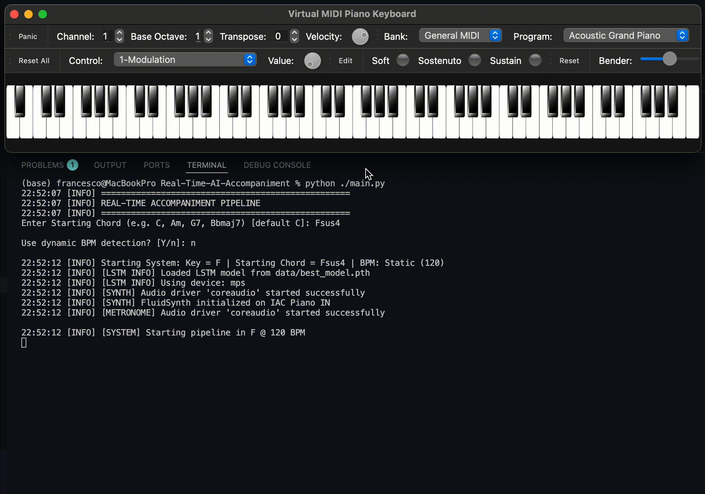

# Real-Time AI Accompaniment

<p align="center">
  <a href="https://drive.google.com/drive/folders/1KKQupkoti1squj6vKVpUubwYWhwCmCqf?usp=drive_link">
    
  </a>
</p>

> **A Real-Time AI Accompanist that listens, understands, and plays with you.**



This project implements a sophisticated **Hybrid AI/Musical-Theory System** capable of generating harmonically appropriate accompaniment in real-time. It combines the predictive power of **Deep Learning (LSTM)** with the responsiveness of a **Rule-Based Musical-Theory System (Ear)**, allowing it to "think ahead" while remaining agile enough to react to your live playing.

> ## 🚧 Work in Progress!
>
> Currently working on it, so feel free to **star** ⭐️ the repo to stay updated!

## 🧠 The Hybrid Engine

The core innovation is the split between **Macro-Prediction** and **Micro-Correction**:

### 1. Macro-Prediction (The "Brain")
An **LSTM (Long Short-Term Memory)** Neural Network, trained on thousands of songs (from the *Chordonomicon* dataset), predicts the most likely harmonic movements.
- **Pre-computation**: To ensure zero latency, the AI "thinks ahead", pre-computing probabilistic chord sequences before they are needed.
- **Context Awareness**: It features a moving window of the last played chords to maintain long-term harmonic coherence.

### 2. Micro-Correction (The "Ear")
A deterministic, low-latency module listens to your live notes in the milliseconds before a chord is triggered.
- **Key Detection**: It automatically detects the key of your performance using the Krumhansl-Schmuckler algorithm.
- **Real-Time Harmonic Analysis**: It maps your input notes to the current key's functions (Tonic, Dominant, Subdominant) and outputs a distribution over the possible chords.
- **Refine predictions**: It refines the predictions of the AI by merging the two distributions.

---

## ⚡ Real-Time Engineering

The system runs on a **4-Thread Architecture** designed to minimize latency:

| Thread | Function | Description |
|--------|----------|-------------|
| **Timing** | `Critical` | The system's "Heartbeat". High-priority scheduler that manages the timeline, queries the Predictor, and schedules events. |
| **Playback** | `Output` | Dedicated thread for FluidSynth audio generation. Decoupled from logic to prevent blocking. |
| **Listener** | `Input` | Asynchronous MIDI capture. Continuously buffers incoming notes for the "Ear" to analyze. |
| **Metronome** | `Sync` | Independent click track to keep human and machine locked in the same groove (E3 E3 D4 E4). |

---

## 📂 Project Structure

Modular architecture included in the `src` package:

```text
src/
├── __init__.py
├── audio/                      # Audio & MIDI I/O
│   ├── metronome.py            # Plays metronome clicks with bar accents
│   ├── midi_io.py              # MIDI playback and I/O utilities
│   ├── midi_listener.py        # Asynchronous MIDI input listener (The "Ear" input)
│   └── synth.py                # Low-latency FluidSynth wrapper for playback
├── config.py                   # Central configuration (BPM, Ports, Constants)
├── model/                      # AI Core
│   ├── ai_harmony.py           # Inference engine wrapping the LSTM model
│   ├── lstm_model.py           # Base LSTM architecture definition
│   ├── train/                  # Training scripts
│   │   ├── __init__.py
│   │   ├── dataloader.py       # Dataloader optimized for chord sequences
│   │   └── train.py            # Main model training loop
│   └── vocabulary.py           # Tokenizer (Chord <-> Index mapping)
├── music/                      # Music Theory Logic
│   ├── __init__.py
│   ├── chord.py                # Chord object representation and MIDI generation
│   ├── ear.py                  # Real-time harmonic analysis (Control System)
│   └── key_detector_major.py   # Krumhansl-Schmuckler Key Detection
├── pipeline/                   # System Orchestration
│   ├── __init__.py
│   ├── playback.py             # Dedicated thread for chord playback
│   ├── pipeline.py             # Main pipeline manager (Threading & Timing)
│   └── predictor.py            # Decision engine (Fuses AI + Ear predictions)
└── utils/                      # Utilities
    ├── __init__.py
    ├── logger.py               # Thread-safe logging setup
    └── music_theory.py         # Core theory rules and Roman numeral conversion
```

---

## 🛠️ Installation

### 1. System Dependencies
You need **FluidSynth** installed on your system for audio generation.
- **macOS**: `brew install fluidsynth`
- **Linux**: `sudo apt-get install fluidsynth`
- **Windows**: using Chocolatey: `choco install fluidsynth`

### 2. Python Dependencies
Install the required packages:
```bash
pip install -r requirements.txt
```

---

## 🎹 Usage

To access the entry point run `python main.py`


### 🛠️ MIDI Routing Setup (macOS)
This system requires proper MIDI routing between input, processing, and audio output.

Create virtual MIDI ports using **Audio MIDI Setup**:
1. Open `/Applications/Utilities/Audio MIDI Setup.app`
2. **Window** → **Show MIDI Studio**
3. Double-click **IAC Driver**
4. Create two ports: `IAC Piano IN` (Output from Python) and `IAC Piano OUT` (Input to Python)

#### Choose your Input Method

**Option A: Virtual Keyboard (VMPK) 💻**
1. **Download & Install VMPK**
2. **Configure VMPK**:
   - **MIDI OUT**: `IAC Piano OUT` (Sends your playing to Python)
   - **MIDI IN**: `IAC Piano IN` (Receives accompaniment from Python to display notes)
   - *Why?* This allows the synth to play both your notes and the generated accompaniment.

**Option B: Physical MIDI Keyboard 🎹**
1. **Connect your Keyboard** via USB.
2. **Configure Python Script** (`src/config.py`):
   - `INPUT_PORT = 'Your Keyboard Name'` (e.g., 'Digital Piano', 'USB MIDI Keyboard')

#### ❓ Why This Setup?
The system needs 2 ports to:
1. Send MIDI OUT to Python (OUTPUT_PORT: `IAC Piano OUT`)
2. Receive MIDI IN from Python (INPUT_PORT: `IAC Piano IN`/`Your Keyboard Name`) for audio playback


### Configuration
All settings (BPM, Key, Ports, Model Params) are centralized in `src/config.py`. Edit this file to customize your session.

## Citation

Chordonomicon dataset:

```bibtex
@article{kantarelis2024chordonomicon,
  title={CHORDONOMICON: A Dataset of 666,000 Songs and their Chord Progressions},
  author={Kantarelis, Spyridon and Thomas, Konstantinos and Lyberatos, Vassilis and Dervakos, Edmund and Stamou, Giorgos},
  journal={arXiv preprint arXiv:2410.22046},
  year={2024}
}
```
